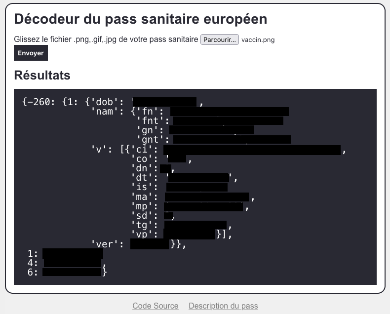

# vacdec

Service web de décodage du certificat Covid européen

Basé sur le script python de [Hanno Böck](https://hboeck.de/)

Le script prend une image avec un code QR d'un certificat vaccinal et montre les données de ce certificat.
**Il n'y a pas de validation de la signature**

Le code est très court et permet de comprendre comment ces certificats sont encodés :

* The QR code encode une chaîne qui débute par "HC1:"
* La chaîne qui suit "HC1:" est encodée base45
* Le décodage base45 donne une donnée binaire compressée avec zlib
* la décompression zblib donne une structure de  Web Token CBOR

## Usage

Via Docker, pour instancier le conteneur :

```bash
docker run -p 80:80 --rm -it $(docker build --quiet .)
```

ou

Via l'interpréteur Python3

```
pip3 install -r requirements.txt
python3 ./app/server.py
```

Allez sur http://127.0.0.1 et uploader l'image



## Ressources

- [Décoder le certificat Covid européen](https://aerogus.net/posts/decoder-certificat-covid-europeen/)

